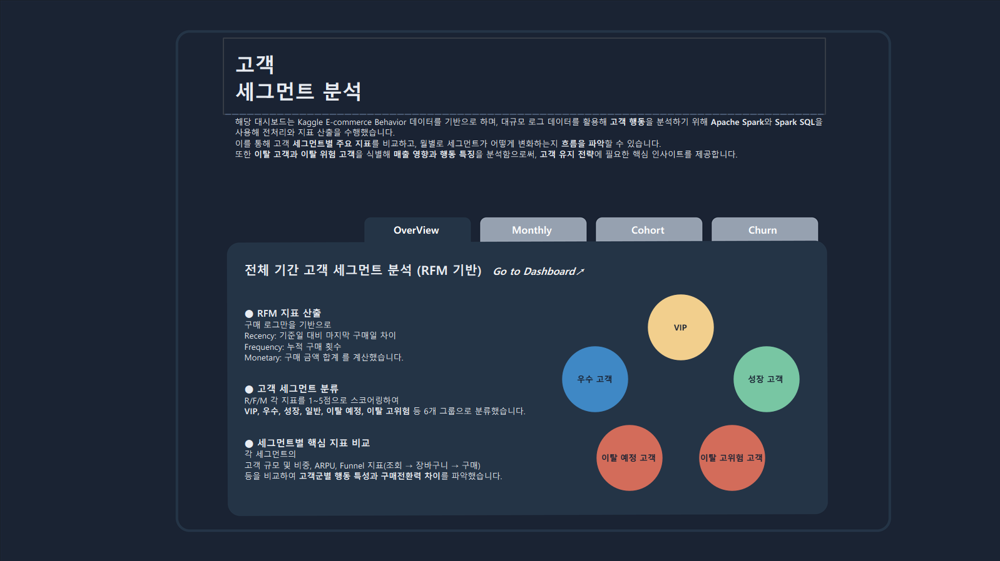
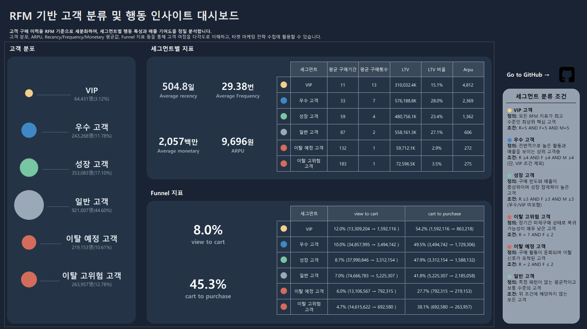

# RFM 고객 세그먼트 분석 대시보드  

  
  

## 프로젝트 개요
본 프로젝트는 **Kaggle E-commerce Behavior 데이터(약 4천만 건)**를 활용해  
고객의 구매 행동을 RFM 기반으로 세분화하고, **월별 고객 흐름(Transition)**을 분석하는 것을 목표로 합니다.

대규모 로그 데이터 특성에 맞추어 **Apache Spark + Delta Lake**로 대용량 전처리 및 월별 스냅샷을 생성하였고, 
세부적인 지표 산출 및 세그먼트 분석은 **PostgreSQL**를 통해 수행했습니다.
최종 분석 결과는 **Tableau 대시보드**로 시각화하여  
VIP·우수·성장·이탈 위험 고객의 분포, 변화, 매출 기여도를 직관적으로 확인할 수 있도록 구현했습니다.

---

## 프로젝트 주제
- **목표:**  
  고객 행동 데이터를 기반으로 RFM 세그먼트를 분류하고,  
  월별 변화(전환·성장·이탈)를 추적하여 세그먼트별 핵심 행동 지표와 매출 변화를 분석한다.

- **기간:** 총 3주  
  - 데이터 처리 및 스냅샷 생성: 0.5주  
  - RFM 스코어링 및 분석: 1.5주  
  - Tableau 대시보드 제작: 1주  

- **기여도:**  
  **100%** (기획 → Spark → SQL → 분석 → 시각화 전 과정 단독 수행)

---

## 데이터 구성
- **출처:** Kaggle – *E-commerce Behavior Data*
- **기간:** 2019-10 ~ 2020-04
- **규모:** 약 4천만 rows (총 20GB - 압축파일 기준)
- **주요 컬럼:**  
  `event_time`, `event_type`, `product_id`, `category_id`,  
  `category_code`, `price`, `user_id`, `user_session`

---

## 프로젝트 진행 과정

### 1) 데이터 로드 및 전처리 (Apache Spark)
- 7개월치 대규모 gzip 로그를 Spark로 병렬 처리  
- Delta Lake 포맷으로 변환해 고속 로딩 및 안정적 데이터 핸들링 확보  
- RFM 분석에 필요한 기준 정의 및 Snapshot용 데이터 구조 설계

---

### 2) RFM 스코어링 & 월별 스냅샷 생성
- **Recency (R):** 해당 월 스냅샷 기준 누적 마지막 구매일  
- **Frequency (F):** 당월 구매 횟수  
- **Monetary (M):** 당월 구매 금액  
- 각 월마다 **독립적으로 세그먼트 재분류** → 고객의 성장, 유지, 이탈 패턴을 동적으로 추적 가능

> #### 세그먼트 유형 (예시)
> 세그먼트는 **NTILE 기반 상대적 분류**를 활용했으며, 이탈 분석에서는 **별도의 절대 기준**을 적용하여 정확한 이탈 고객 구분을 수행했습니다.
> - **VIP 고객**
> - **우수 고객**
> - **성장 고객**
> - **일반 고객**
> - **이탈 예정 고객**
> - **이탈 고위험 고객**

---

### 3) 세그먼트 분석 (Spark SQL + PostgreSQL)
- 월별 고객 세그먼트 테이블 생성  
- **Transition Matrix** 구축 (예: 일반 → 성장 → 우수 → VIP)  
- 세그먼트별 매출 기여도 및 ARPU 분석  
- R/F/M 정규화 지표 산출  
- 고객 유지율을 파악하기 위한 **코호트 분석** 수행  
- 이탈 전후 행동 변화 분석  
- 이탈로 인한 **매출 감소액(손익)** 추정

---

### 4) Tableau 대시보드 시각화
- 월별 세그먼트 분포 시각화  
- **Transition Flow**를 통한 고객 이동 경로 파악  
- 세그먼트별 KPI(ARPU, 구매 횟수, 이탈률 등)  
- 이탈 위험 고객 모니터링  
- 세그먼트별 R/F/M 특성 비교  
- 탭 구성으로 **웹사이트형 UX**를 적용한 대시보드 디자인

> #### 대시보드 구성
> - **전체 세그먼트 지표**  
>  전체 기간 기준으로 고객 세그먼트별 핵심 KPI(ARPU, R/F/M, 비중 등)를 비교할 수 있는 overview 페이지
> - **월별 세그먼트 지표**  
>   각 월의 RFM 세그먼트 분포·변화·전환 흐름(Transition)을 시각적으로 확인할 수 있는 핵심 화면
> - **코호트 분석**  
>   고객 유지율을 월 단위로 추적하여, 세그먼트별/기간별 재구매 패턴을 분석한 페이지
> - **이탈 유저 지표**  
>   이탈 예정 및 이탈 고위험 고객의 비중 변화, 행동 특징, 매출 감소 영향 등을 파악하는 전용 모니터링 페이지

---

## 대시보드 주요 기능 (요약)
- RFM 기반 세그먼트별 핵심 지표 파악  
- 월별 고객 세그먼트 **비중 변화 분석**  
- **성장·우수·VIP 전환율** 및 유입 흐름 분석  
- 세그먼트별 카테고리 선호도 분석  
- 고객 유지율 확인을 위한 **코호트 분석**  
- **이탈 예정/고위험 세그먼트 비중 변화** 모니터링  
- 세그먼트별 KPI 및 행동 패턴 비교  
- 월별 스냅샷을 통한 **동적 고객 여정 분석**
---

## 사용 기술 스택

| 구분 | 기술 |
|------|------|
| **데이터 처리** | Apache Spark, Delta Lake, PySpark |
| **데이터베이스** | PostgreSQL |
| **언어** | Python, SQL |
| **라이브러리** | pandas, pyspark.sql, numpy |
| **시각화** | Tableau |
| **분석 기법** | RFM Analysis, Cohort Analysis, Segment Transition, Uplift 분석 |

---

## RFM 분석을 활용한 이유
- 구매 행동 기반 **명확한 고객 그룹화** 가능  
- CRM 실무에서 전환·이탈 설명력이 높은 핵심 지표  
- 월 단위 Snapshot으로 **고객의 성장/이탈 흐름 분석에 최적화**  
- 이탈 그룹의 행동 특징 파악을 통해 **이탈 피해 최소화 인사이트 제공**  
- 향후 머신러닝 기반 **이탈 예측 모델의 핵심 입력 변수로 활용 가능*

---

